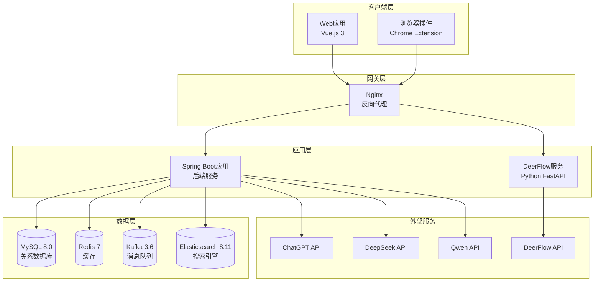
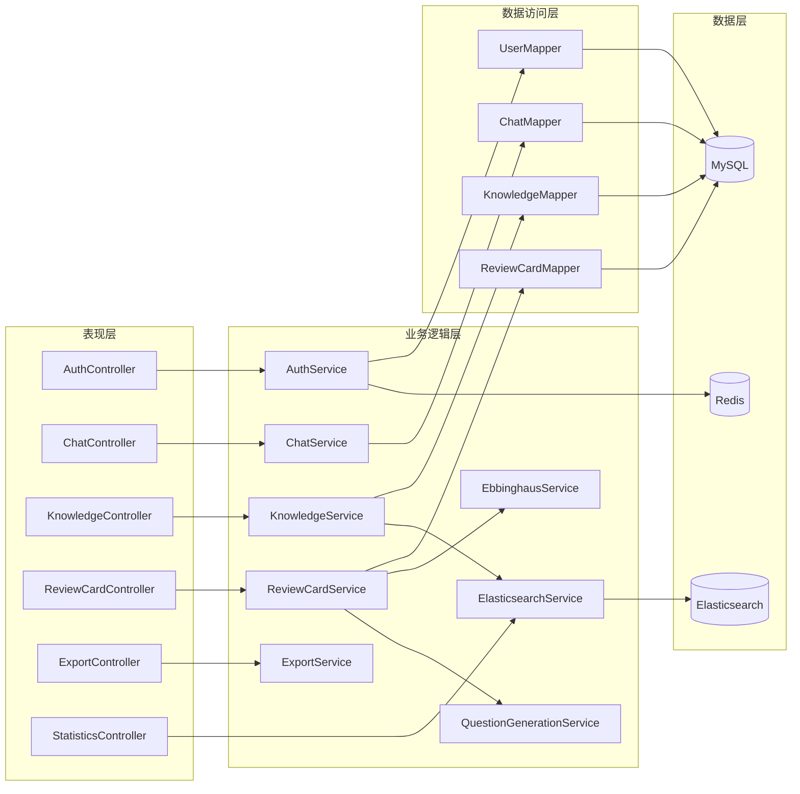

# AI-SecondBrain 项目架构总览

## 1. 项目整体架构

AI-SecondBrain是一个基于AI的知识管理系统，采用前后端分离架构，包含Web应用、浏览器插件和AI服务三个主要部分。



## 2. 目录结构

```
AI-SecondBrain/
├── src/main/java/com/secondbrain/    # 后端源代码
│   ├── AiSecondBrainApplication.java # 主启动类
│   ├── common/                      # 公共类
│   ├── config/                      # 配置类
│   ├── controller/                  # 控制器层
│   ├── dto/                        # 数据传输对象
│   ├── elasticsearch/               # ES集成
│   ├── entity/                     # 实体类
│   ├── exception/                   # 异常处理
│   ├── interceptor/                 # 拦截器
│   ├── kafka/                      # Kafka集成
│   ├── mapper/                     # 数据访问层
│   ├── service/                    # 业务逻辑层
│   ├── task/                       # 定时任务
│   ├── util/                       # 工具类
│   └── vo/                        # 视图对象
├── frontend/                       # 前端源代码
│   ├── src/
│   │   ├── api/                   # API接口
│   │   ├── layout/                # 布局组件
│   │   ├── router/                # 路由配置
│   │   ├── stores/                # 状态管理
│   │   ├── utils/                 # 工具函数
│   │   ├── views/                 # 页面组件
│   │   ├── App.vue                # 根组件
│   │   └── main.js                # 入口文件
│   ├── package.json
│   └── vite.config.js
├── deerflow/                      # DeerFlow AI服务
│   ├── deer-flow/
│   │   ├── backend/               # 后端服务
│   │   ├── frontend/              # 前端界面
│   │   └── docker/               # Docker配置
│   ├── api_server.py              # API服务器
│   └── config.yaml               # 配置文件
├── extension/                     # 浏览器插件
│   ├── manifest.json              # 插件配置
│   ├── popup.html                 # 弹窗页面
│   ├── popup.js                   # 弹窗逻辑
│   ├── content.js                 # 内容脚本
│   ├── background.js              # 后台脚本
│   └── icons/                    # 图标资源
├── competition_docs/              # 竞赛文档
│   ├── 01_需求分析.md
│   ├── 02_概要设计.md
│   └── 03_详细设计.md
├── cansaiziliao/                 # 参赛资料
│   ├── 01-1 软件应用与开发类作品提交要求（2025版）V2-1.docx
│   ├── 01-2 作品信息摘要模板（2025版）V2.docx
│   └── 01-3 软件应用与开发类作品设计和开发文档模板（2025版）.docx
├── docker-compose.yml            # Docker编排
├── Dockerfile                    # Docker配置
└── README.md                    # 项目说明
```

## 3. 后端架构

### 3.1 分层架构



### 3.2 核心模块

#### 3.2.1 用户认证模块
- **Controller**: `AuthController`
- **Service**: `AuthService`
- **功能**:
  - 用户注册/登录
  - JWT Token生成与验证
  - 密码加密（BCrypt）
  - 用户信息管理

#### 3.2.2 对话采集模块
- **Controller**: `ChatController`, `CaptureController`
- **Service**: `ChatService`, `NoteCaptureService`, `DocumentCaptureService`
- **功能**:
  - 对话内容采集
  - 批量导入
  - AI知识提取
  - 对话记录管理

#### 3.2.3 知识管理模块
- **Controller**: `KnowledgeController`
- **Service**: `KnowledgeService`, `ImportanceCalculationService`
- **功能**:
  - 知识点CRUD
  - 知识点搜索
  - 重要程度计算
  - 批量导出

#### 3.2.4 复习管理模块
- **Controller**: `ReviewCardController`
- **Service**: `ReviewCardService`, `EbbinghausService`, `QuestionGenerationService`
- **功能**:
  - 复习卡片生成
  - 艾宾浩斯复习算法
  - 复习进度追踪
  - 连续学习天数计算

#### 3.2.5 搜索模块
- **Service**: `ElasticsearchService`
- **功能**:
  - 全文搜索
  - 关键词高亮
  - 相关性排序
  - 分页查询

#### 3.2.6 导出模块
- **Controller**: `ExportController`
- **Service**: `ExportService`
- **功能**:
  - Markdown导出
  - PDF导出
  - Word导出
  - JSON导出
  - CSV导出

#### 3.2.7 统计模块
- **Controller**: `StatisticsController`
- **Service**: `ReportService`
- **功能**:
  - 学习数据统计
  - 复习完成率
  - 掌握程度分析
  - 学习报告生成

#### 3.2.8 AI服务模块
- **Controller**: `AiController`, `DeerFlowResearchController`
- **Service**: `AiService`, `DeerFlowResearchService`, `EmbeddingService`
- **功能**:
  - 知识提取
  - 题目生成
  - 文本嵌入
  - 研究报告生成

### 3.3 数据库设计

#### 核心表结构

**user（用户表）**
```sql
- id: 主键
- username: 用户名（唯一）
- password: 密码（BCrypt加密）
- email: 邮箱
- phone: 手机号
- bio: 个人简介
- avatar: 头像URL
- register_time: 注册时间
- last_login_time: 最后登录时间
- create_time: 创建时间
- update_time: 更新时间
- deleted: 删除标记
```

**raw_chat_record（原始对话记录表）**
```sql
- id: 主键
- user_id: 用户ID
- platform: 来源平台（ChatGPT/DeepSeek/Kimi）
- content: 对话内容
- source_url: 原始链接
- create_time: 创建时间
- update_time: 更新时间
- deleted: 删除标记
```

**knowledge_node（知识节点表）**
```sql
- id: 主键
- user_id: 用户ID
- chat_record_id: 来源对话记录ID
- title: 知识点标题
- content_md: Markdown格式内容
- summary: 摘要
- vector_id: 向量ID（用于Elasticsearch）
- importance: 重要程度（1-5）
- mastery_level: 掌握程度（0-100）
- review_count: 复习次数
- create_time: 创建时间
- update_time: 更新时间
- last_review_time: 最后复习时间
- next_review_time: 下次复习时间
- deleted: 删除标记
```

**review_card（复习卡片表）**
```sql
- id: 主键
- node_id: 知识节点ID
- user_id: 用户ID
- question: 题目内容
- answer: 正确答案
- card_type: 卡片类型（choice/fill/essay）
- difficulty: 题目难度（1-3）
- review_count: 复习次数
- correct_count: 正确次数
- incorrect_count: 错误次数
- average_accuracy: 平均正确率
- mastery_level: 掌握程度（0-5）
- memory_strength: 记忆强度（0.0-1.0）
- last_review_time: 最后复习时间
- next_review_time: 下次复习时间
- status: 状态（0-待复习，1-已完成）
- ai_generated: 是否AI生成
- create_time: 创建时间
- update_time: 更新时间
- deleted: 删除标记
```

**review_log（复习记录表）**
```sql
- id: 主键
- card_id: 复习卡片ID
- node_id: 知识节点ID
- user_id: 用户ID
- is_correct: 是否正确
- duration: 复习时长（秒）
- create_time: 创建时间
```

### 3.4 消息队列集成

**Kafka主题**:
- `chat-collect-topic`: 对话采集主题
- `knowledge-extract-topic`: 知识提取主题

**生产者**: `KafkaProducerService`
**消费者**: `KafkaConsumerService`

### 3.5 定时任务

**ReviewScheduleTask**: 复习提醒定时任务
- 使用Quartz框架
- 定时检查待复习卡片
- 发送复习提醒通知

## 4. 前端架构

### 4.1 技术栈
- **框架**: Vue.js 3
- **UI库**: Element Plus
- **路由**: Vue Router 4
- **状态管理**: Pinia
- **HTTP客户端**: Axios
- **构建工具**: Vite 5

### 4.2 目录结构

```
frontend/
├── src/
│   ├── api/                   # API接口封装
│   │   ├── auth.js           # 认证接口
│   │   ├── chat.js           # 对话接口
│   │   ├── knowledge.js      # 知识接口
│   │   ├── review.js         # 复习接口
│   │   ├── export.js         # 导出接口
│   │   ├── statistics.js     # 统计接口
│   │   └── ...
│   ├── layout/                # 布局组件
│   │   └── MainLayout.vue    # 主布局
│   ├── router/                # 路由配置
│   │   └── index.js         # 路由定义
│   ├── stores/                # 状态管理
│   │   └── user.js         # 用户状态
│   ├── utils/                 # 工具函数
│   │   └── request.js      # HTTP请求封装
│   ├── views/                 # 页面组件
│   │   ├── Login.vue        # 登录页
│   │   ├── Register.vue     # 注册页
│   │   ├── Dashboard.vue    # 仪表板
│   │   ├── Knowledge.vue    # 知识管理
│   │   ├── Review.vue       # 复习中心
│   │   ├── Chat.vue        # 对话管理
│   │   ├── Search.vue      # 搜索页面
│   │   ├── Report.vue      # 学习报告
│   │   ├── Settings.vue    # 设置页面
│   │   └── ...
│   ├── App.vue               # 根组件
│   └── main.js               # 入口文件
├── package.json
├── vite.config.js
└── Dockerfile
```

### 4.3 核心页面

#### 4.3.1 知识管理页面（Knowledge.vue）
- 知识点列表展示
- 知识点详情查看
- 知识点编辑/删除
- 批量导出
- 手动生成题目

#### 4.3.2 复习中心页面（Review.vue）
- 今日待复习卡片
- 复习答题界面
- 复习结果展示
- 复习进度统计
- 连续学习天数

#### 4.3.3 对话管理页面（Chat.vue）
- 对话记录列表
- 对话详情查看
- 批量导入对话
- AI知识提取

#### 4.3.4 搜索页面（Search.vue）
- 全文搜索
- 关键词高亮
- 搜索结果展示

#### 4.3.5 学习报告页面（Report.vue）
- 学习数据统计
- 复习完成率
- 掌握程度分析
- 学习趋势图表

## 5. 浏览器插件架构

### 5.1 技术栈
- **平台**: Chrome Extension (Manifest V3)
- **语言**: JavaScript (ES6+)
- **权限**: activeTab, storage, scripting

### 5.2 文件结构

```
extension/
├── manifest.json          # 插件配置文件
├── popup.html            # 弹窗页面HTML
├── popup.js              # 弹窗页面逻辑
├── content.js            # 内容脚本（注入到网页）
├── background.js         # 后台服务脚本
├── icons/               # 图标目录
│   └── icon.svg         # SVG图标
└── README.md            # 说明文档
```

### 5.3 核心功能

#### 5.3.1 content.js（内容脚本）
- 检测当前网站
- 提取对话内容
- 注入采集按钮
- 处理采集请求

#### 5.3.2 popup.js（弹窗脚本）
- 用户登录/登出
- 显示登录状态
- 跳转到知识库

#### 5.3.3 background.js（后台脚本）
- 处理插件消息
- 与后端API通信
- 存储用户Token

### 5.4 支持的平台
- **ChatGPT**: chatgpt.com, chat.openai.com
- **DeepSeek**: deepseek.com
- **Kimi**: kimi.moonshot.cn

## 6. DeerFlow服务架构

### 6.1 技术栈
- **框架**: FastAPI (Python)
- **AI模型**: DeepSeek, Qwen
- **前端**: Next.js

### 6.2 核心功能
- 研究报告生成
- AI对话处理
- 文本分析
- 知识提取辅助

## 7. 技术栈总结

### 7.1 后端技术栈
| 技术 | 版本 | 用途 |
|------|------|------|
| Spring Boot | 3.1.5 | 应用框架 |
| Java | 21 | 编程语言 |
| MyBatis-Plus | 3.5.3.1 | ORM框架 |
| MySQL | 8.0 | 关系数据库 |
| Redis | 7 | 缓存 |
| Kafka | 3.6 | 消息队列 |
| Elasticsearch | 8.11 | 搜索引擎 |
| JWT | - | 认证 |
| Knife4j | 4.3.0 | API文档 |

### 7.2 前端技术栈
| 技术 | 版本 | 用途 |
|------|------|------|
| Vue.js | 3 | 前端框架 |
| Element Plus | - | UI组件库 |
| Vue Router | 4 | 路由管理 |
| Pinia | - | 状态管理 |
| Axios | - | HTTP客户端 |
| Vite | 5 | 构建工具 |

### 7.3 浏览器插件技术栈
| 技术 | 版本 | 用途 |
|------|------|------|
| Chrome Extension | Manifest V3 | 插件平台 |
| JavaScript | ES6+ | 编程语言 |

### 7.4 AI服务技术栈
| 技术 | 版本 | 用途 |
|------|------|------|
| FastAPI | - | Web框架 |
| Python | 3.13 | 编程语言 |
| DeepSeek API | - | AI服务 |
| Qwen API | - | AI服务 |

## 8. 部署架构

### 8.1 Docker部署

```yaml
version: '3.8'
services:
  mysql:
    image: mysql:8.0
    ports:
      - "3306:3306"
    environment:
      MYSQL_ROOT_PASSWORD: root
      MYSQL_DATABASE: second_brain

  redis:
    image: redis:7
    ports:
      - "6379:6379"

  kafka:
    image: confluentinc/cp-kafka:latest
    ports:
      - "9092:9092"
    environment:
      KAFKA_ZOOKEEPER_CONNECT: zookeeper:2181
      KAFKA_ADVERTISED_LISTENERS: PLAINTEXT://localhost:9092

  elasticsearch:
    image: elasticsearch:8.11.0
    ports:
      - "9200:9200"
    environment:
      discovery.type: single-node

  backend:
    build: .
    ports:
      - "8080:8080"
    depends_on:
      - mysql
      - redis
      - kafka
      - elasticsearch

  frontend:
    build: ./frontend
    ports:
      - "3000:80"
    depends_on:
      - backend

  nginx:
    image: nginx:alpine
    ports:
      - "80:80"
    volumes:
      - ./nginx.conf:/etc/nginx/nginx.conf
    depends_on:
      - backend
      - frontend
```

### 8.2 端口映射

| 服务 | 端口 | 说明 |
|------|------|------|
| MySQL | 3306 | 数据库 |
| Redis | 6379 | 缓存 |
| Kafka | 9092 | 消息队列 |
| Elasticsearch | 9200 | 搜索引擎 |
| 后端服务 | 8080 | Spring Boot应用 |
| 前端服务 | 3000 | Vue.js应用 |
| Nginx | 80 | 反向代理 |

## 9. 数据流向

### 9.1 对话采集流程

```
用户在AI平台对话
    ↓
点击浏览器插件"采集"按钮
    ↓
content.js提取对话内容
    ↓
发送到后端API (/api/chat/collect)
    ↓
ChatService保存到MySQL
    ↓
发送到Kafka (chat-collect-topic)
    ↓
KafkaConsumerService消费消息
    ↓
调用AI服务提取知识
    ↓
保存知识点到MySQL
    ↓
索引到Elasticsearch
    ↓
返回成功提示
```

### 9.2 复习流程

```
用户访问复习中心
    ↓
获取今日待复习卡片 (/api/review/list)
    ↓
显示复习题目
    ↓
用户提交答案 (/api/review/submit)
    ↓
验证答案正确性
    ↓
更新复习记录
    ↓
计算下次复习时间（艾宾浩斯算法）
    ↓
更新知识点复习状态
    ↓
显示复习结果
```

### 9.3 搜索流程

```
用户输入搜索关键词
    ↓
发送搜索请求 (/api/search)
    ↓
ElasticsearchService查询ES
    ↓
返回搜索结果（高亮关键词）
    ↓
前端展示搜索结果
```

## 10. 核心算法

### 10.1 艾宾浩斯遗忘曲线算法
- **复习间隔**: 24小时 → 7天 → 14天 → 30天 → 60天
- **动态调整**: 根据答题正确率调整间隔
- **记忆强度**: 根据复习次数和正确率计算

### 10.2 AI题目生成算法
- **内容分析**: 分析知识点内容，提取关键信息
- **题目生成**: 根据内容类型生成选择题/填空题
- **质量评估**: 评估题目质量和难度
- **难度计算**: 综合考虑内容复杂度、重要程度、掌握程度

### 10.3 连续学习天数计算
- **算法**: 从今天开始向前遍历，检查每天是否有复习记录
- **激励**: 显示连续学习天数，激励用户保持学习习惯

## 11. 项目亮点

1. **完整的技术栈**: 涵盖前端、后端、数据库、缓存、消息队列、搜索引擎
2. **AI集成**: 支持多个AI提供商，自动提取知识点和生成题目
3. **科学复习**: 基于艾宾浩斯遗忘曲线的智能复习算法
4. **分布式架构**: 使用Kafka实现异步处理，提升系统性能
5. **全文搜索**: Elasticsearch提供高效的搜索功能
6. **用户认证**: JWT + Spring Security实现安全的认证机制
7. **浏览器插件**: 无缝集成AI平台，一键采集对话
8. **Docker部署**: 一键部署，简化运维

## 12. 总结

AI-SecondBrain是一个功能完整、架构清晰的知识管理系统。项目采用前后端分离架构，包含Web应用、浏览器插件和AI服务三个主要部分。后端使用Spring Boot框架，前端使用Vue.js框架，数据库使用MySQL，缓存使用Redis，消息队列使用Kafka，搜索引擎使用Elasticsearch。项目实现了对话采集、知识提取、知识管理、智能复习、全文搜索等核心功能，是一个技术先进、功能实用的知识管理平台。